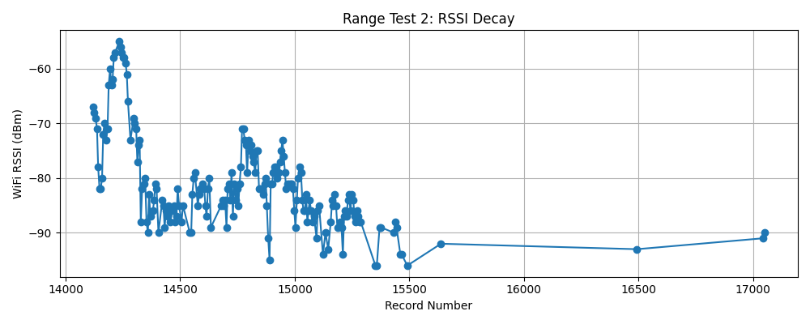
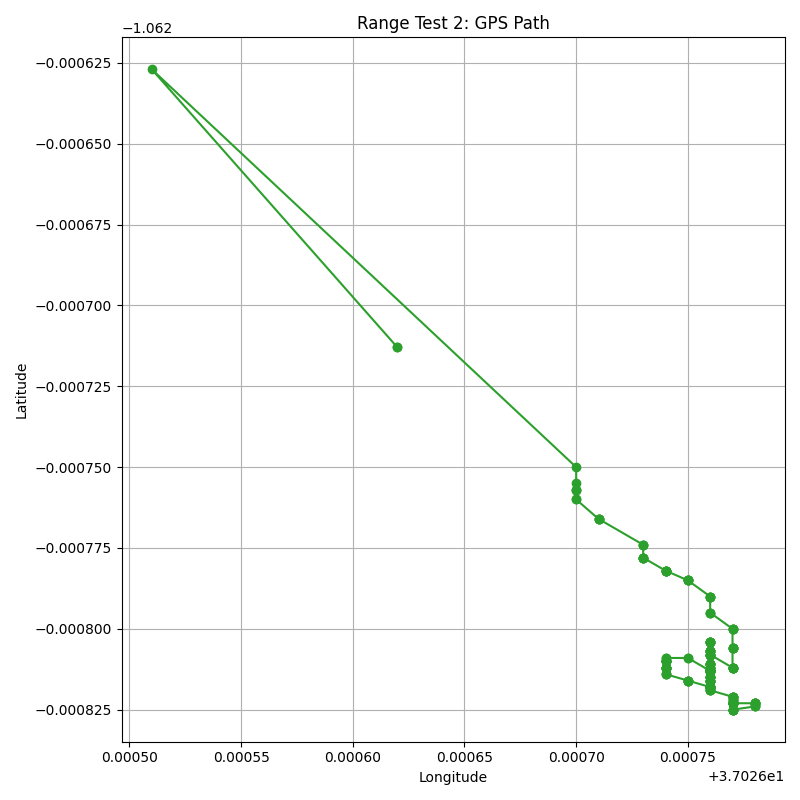

# Range Test 2 Outcome Report

**Date:** August 13, 2025

## Distance Covered
- Walking: **500 m**
- Car: **700 m**

---

## Merits
- Clean data stream throughout the test.
- Successful ARM and DISARM operations.
- Location data acquired and logged.
- Range Test 1 errors from previous run1 were fixed:
  - Laptop lagging resolved.
  - ESP no longer stops streaming after reset.
- Data Was logged to SD Card. 

---

## Demerits
- Test started late, reducing available time.
- Base station Mosquitto startup failure (MQTT broker issue).
- Battery pack level mix-up; required mid-test replacement.
- ESP antenna disconnected from amplifier during test.
- No multimeter available for troubleshooting.
- Serial cable kept disconnecting, causing intermittent data loss.

---

## Probable Causes of Limited Distance
- Physical obstacles along the test path (cars, lorries, motorbikes).
- No way to verify if base station amplifier was working at 100%.
- Possible hardware issues:
  - Antenna disconnect.
  - Amplifier not powered up.
- Possible software issues:
  - Large data packets (~150 bytes).
  - MQTT setup/configuration.

---

## Hardware/Design Notes
- Circuit inspection revealed slightly broken traces on the base station PCB; etching procedure or design needs rethinking. Use larger traces.
- Consider using perforated boards for future builds.

---
## Conclusion
Base station Amplifier was likely not powered, as seen from RSSI values (should be -20 to -70 at close range). Team should have detected this before departing. A multimeter test should be part of pre-test procedure.

---

## Recommendations
- Redraft and strictly follow test procedures to avoid wasted prep time.
- For cable issues: Consider switching from serial cable to Bluetooth, or use ESP-01 to receive data via UART and transmit wirelessly to the laptop.

---
## Data Analysis: RSSI Decay and GPS Path

**RSSI Decay Plot:**

**GPS Path Plot:**

*Interpretation: RSSI values decayed as distance increased, with notable drops at points of hardware/cable issues. GPS path shows the movement during the test, confirming location data was logged.*

---
## Technical Appendix: Beacon + ESP-NOW Telemetry Link

**Overview:**
- Downlink: Custom 802.11 Beacon frames broadcast CSV telemetry from flight computer (AP interface).
- Uplink: ESP-NOW unicast commands from ground station to flight computer.
- Mode control: MQTT can be enabled, but strict beacon mode uses only AP + ESP-NOW.

**WiFi Setup:**
- Mode: WIFI_AP_STA
- MACs: AP interface set to ROCKET_MAC; ground station uses BASE_MAC.
- Channel: Fixed channel shared by both devices.
- AP startup: WiFi.softAP(ssid, nullptr, channel, hidden=true)
- ESP-NOW: esp_now_init() after WiFi up; BASE_MAC added as peer.

**Beacon Frame Structure:**
- 802.11 Management Frame: Beacon
- MAC addresses: DA=broadcast, SA=ROCKET_MAC, BSSID=ROCKET_MAC
- Tagged parameters: SSID, rates, channel, vendor-specific IE (CSV telemetry)
- Payload: 25-field CSV string (same as MQTT), sequence number, length, optional checksum
- Size: <230 bytes for reliability

**ESP-NOW Setup:**
- Runs in STA context while AP is active
- Peering: BASE_MAC for commands; optional rocket→base ESP-NOW telemetry
- Callbacks: send_cb, recv_cb
- Encryption: optional

**Reliability:**
- Downlink: Beacon frames broadcast CSV at fixed rate; sequence numbers for loss detection
- Uplink: ESP-NOW commands (ARM/DISARM, etc.)
- Stream guarantees: AP started before beacon TX, fixed channel, preallocated buffers, prioritized tasks

**Data Consistency:**
- Single 25-field CSV buffer used for beacon, MQTT, SD logging

**Ground Station Expectations:**
- Tune to same WiFi channel
- Parse vendor IE for CSV payload
- Maintain ESP-NOW peer
- Use sequence numbers for packet loss

**Operational Notes:**
- "Invalid interface 1" or LoadProhibited: Ensure AP is started before esp_now_init and beacon TX; avoid double-initialization.

---

**End of Report**
